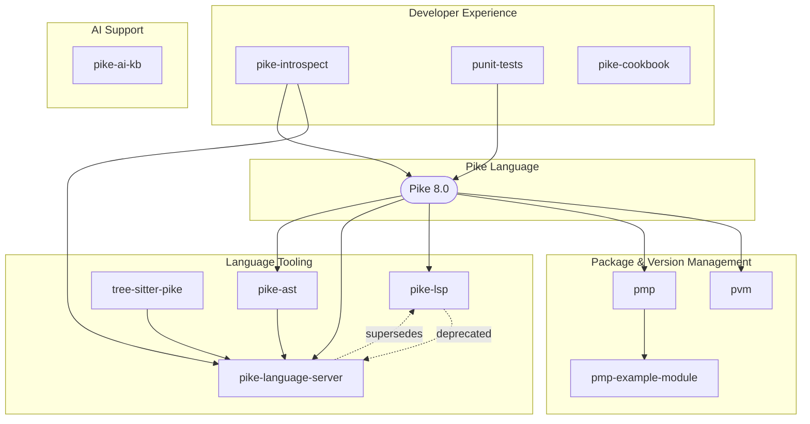

<div align="center">
  <h1>pike-dev</h1>
  <p><strong>Everything you need to build with Pike.</strong></p>

  [](LICENSE)
  [](https://github.com/TheSmuks)
  [](https://pike.lysator.liu.se/)
</div>

## Projects

### Language Tooling

| Project | Description | Status |
|---------|-------------|--------|
| [pike-language-server](https://github.com/TheSmuks/pike-language-server) | Tier-3 LSP — syntax highlighting, diagnostics, completions, hover | Active |
| [pike-ast](https://github.com/TheSmuks/pike-ast) | AST library — tokenization, parsing, querying, pattern matching | Active |
| [tree-sitter-pike](https://github.com/TheSmuks/tree-sitter-pike) | Tree-sitter grammar for Pike 8.0.1116 | Active |
| [pike-lsp](https://github.com/TheSmuks/pike-lsp) | Legacy LSP — superseded by pike-language-server | Maintenance |

### Package & Version Management

| Project | Description | Status |
|---------|-------------|--------|
| [pvm](https://github.com/TheSmuks/pvm) | Pike Version Manager — install and switch between Pike versions | Active |
| [pmp](https://github.com/TheSmuks/pmp) | Package manager — install, version, and resolve dependencies | Active |
| [pmp-example-module](https://github.com/TheSmuks/pmp-example-module) | Minimal example of a pmp-installable Pike module | Active |

### Developer Experience

| Project | Description | Status |
|---------|-------------|--------|
| [punit-tests](https://github.com/TheSmuks/punit-tests) | JUnit-inspired testing framework for Pike | Active |
| [pike-introspect](https://github.com/TheSmuks/pike-introspect) | Runtime introspection — symbol inspection and LLM agent skill | Active |
| [pike-cookbook](https://github.com/TheSmuks/pike-cookbook) | Complete Pike 8.0 programming cookbook with recipes and examples | Active |

### AI & LLM Support

| Project | Description | Status |
|---------|-------------|--------|
| [pike-ai-kb](https://github.com/TheSmuks/pike-ai-kb) | Curated, runtime-verified knowledge base — 130+ stdlib modules, MCP server | Active |

## Ecosystem



## Quick Start

```bash
git clone --recurse-submodules https://github.com/TheSmuks/pike-dev.git
cd pike-dev
```

<details>
<summary>More clone options</summary>

Or initialize submodules after cloning:

```bash
git clone https://github.com/TheSmuks/pike-dev.git
cd pike-dev
git submodule update --init --recursive
```

Update all submodules to their latest versions:

```bash
git submodule update --remote
```

</details>

## Toolchain Flow

```
1. Install Pike      →  pvm (Pike Version Manager)
2. Manage deps      →  pmp (Pike Module Package Manager)
3. Develop          →  pike-language-server (LSP for IDE support)
4. Test             →  punit-tests (JUnit-style testing framework)
5. Debug            →  pike-introspect (runtime introspection)
6. AI Assist        →  pike-ai-kb (knowledge base + MCP tools)
```

<details>
<summary><strong>Contributing & Development</strong></summary>

## Contributing

Contributions are welcome. Please see [CONTRIBUTING.md](./CONTRIBUTING.md) for guidelines.

## Development Setup

Each submodule is an independent repository. After cloning with submodules:

```bash
# Verify all submodules are present
ls -la repos/

# Update a specific submodule
cd repos/pike-language-server
git pull origin main
cd ../..
git add repos/pike-language-server
git commit -m "Update pike-language-server"
```

## Running Tests

```bash
# Run tests in a specific submodule
cd repos/pike-language-server
make test

# Run tests in all submodules
for repo in repos/*; do
  (cd "$repo" && make test 2>/dev/null) || echo "No test target: $repo"
done
```

</details>

<details>
<summary><strong>Adding New Submodules</strong></summary>

## Adding a New Submodule

1. **Create the repository** under [TheSmuks](https://github.com/TheSmuks)

2. **Add as a submodule** inside `repos/`:
   ```bash
   git submodule add https://github.com/TheSmuks/new-project.git repos/new-project
   ```

3. **Configure the submodule** (optional):
   ```bash
   cd repos/new-project
   git checkout main
   cd ..
   ```

4. **Commit the submodule reference**:
   ```bash
   git add repos/new-project
   git commit -m "Add new-project as a submodule"
   git push origin main
   ```

5. **Update this README**:
   - Add the project to the appropriate category under [Projects](#projects)
   - Update the ecosystem diagram
   - Update the toolchain flow if applicable

## Removing a Submodule

```bash
# Deinitialize the submodule
git submodule deinit -f repos/old-project

# Remove from index
git rm repos/old-project

# Remove the directory
rm -rf repos/old-project

# Commit
git commit -m "Remove old-project submodule"
```

## Submodule Best Practices

- Each submodule maintains its own git history, CI/CD, and release cycle
- The hub repo only tracks commit references via `.gitmodules`
- Always fetch and merge in the submodule before updating the hub reference
- Use annotated tags for releases; hub repo should track those tags

</details>

## Architecture

See [docs/architecture.md](./docs/architecture.md) for the full ecosystem overview, dependency graph, and inter-project relationships.

## License

This project is licensed under the [MIT License](./LICENSE).