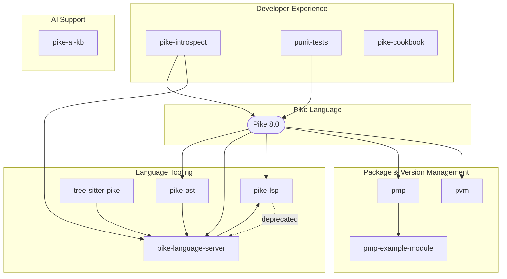

# Architecture

> This document describes the Pike development ecosystem structure. Keep it updated as the ecosystem evolves.

## Overview

`pike-dev` is a meta-repo that aggregates all Pike-related projects as git submodules. It provides a single entry point for the Pike development toolchain.

## Ecosystem Diagram



## Project Categories

### Language Tooling

| Project | Description | Language |
|---------|-------------|----------|
| `pike-language-server` | Tier-3 LSP implementation | Pike 8.0 |
| `pike-lsp` | Legacy LSP with VSCode extension | TypeScript/Node.js |
| `tree-sitter-pike` | Tree-sitter grammar for Pike | JavaScript |
| `pike-ast` | AST library (tokenizer, parser, query) | Pike 8.0 |

### Package & Version Management

| Project | Description |
|---------|-------------|
| `pvm` | Pike Version Manager — install, manage, switch versions |
| `pmp` | Package manager for Pike modules |
| `pmp-example-module` | Minimal example of a pmp-installable module |

### Developer Experience

| Project | Description |
|---------|-------------|
| `punit-tests` | JUnit-inspired testing framework |
| `pike-introspect` | Runtime introspection + LLM agent skill |
| `pike-cookbook` | Pike 8.0 programming cookbook |

### AI & LLM Support

| Project | Description |
|---------|-------------|
| `pike-ai-kb` | Knowledge base for AI code generation |
| `pike-introspect` | Provides agent skill for LLM-assisted development |

## Dependency Graph

```
                    Pike Runtime
                         |
         +--------------+---------------+
         |              |               |
         v              v               v
       pvm            pmp           pike-ast
         |              |               |
         |              v               v
         |        pmp-example-module tree-sitter-pike
         |              |               |
         +------+-------+               |
                |                       |
                v                       v
          pike-language-server <-------+ (uses AST, TSP, pike-introspect)
```

## Submodule Structure

Each submodule is an independent repository with its own:
- Version control (git)
- CI/CD pipelines
- Documentation
- Release cycle

The hub repo (`pike-dev`) only tracks commit references via `.gitmodules`.

## Toolchain Flow

1. **Installation**: `pvm` to manage Pike versions
2. **Package Management**: `pmp` for dependencies
3. **Development**: `pike-language-server` for IDE support
4. **Testing**: `punit-tests` for test automation
5. **Introspection**: `pike-introspect` for debugging
6. **AI Assistance**: `pike-ai-kb` for code generation

## Inter-project Dependencies

| From | To | Type |
|------|-----|------|
| `pike-ast` | `tree-sitter-pike` | Grammar dependency |
| `pike-language-server` | `pike-ast` | Uses for parsing |
| `pike-language-server` | `pike-introspect` | Uses for type info |
| `pmp` | `pmp-example-module` | Reference impl |

## Maintenance

- **Active**: Regular updates and new features
- **Maintenance**: Bug fixes only, no new features (see `pike-lsp`)

## Adding New Submodules

1. Create the repository under `TheSmuks`
2. Add as submodule: `git submodule add https://github.com/TheSmuks/new-project.git repos/new-project`
3. Commit and push the submodule reference
4. Update README.md and this document

## References

- [Pike Programming Language](https://pike.lysator.liu.se/)
- [Pike Language Server](https://github.com/TheSmuks/pike-language-server)
- [pmp Package Manager](https://github.com/TheSmuks/pmp)
- [Pike AST Library](https://github.com/TheSmuks/pike-ast)
